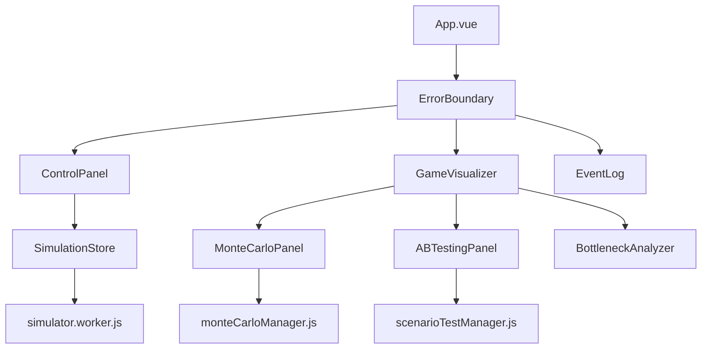

# 📚 API Reference

This document provides detailed technical documentation for the Time Hero Game Balance Simulator's architecture, components, and APIs.

## 🏗️ Architecture Overview

### Core Components



### Data Flow

1. **Initialization**: App loads CSV data via `importers.js`
2. **State Management**: Pinia stores manage reactive state
3. **Simulation**: Web workers handle background computation
4. **Analysis**: Specialized managers process statistical analysis
5. **Visualization**: Vue components render real-time updates

## 🏪 Pinia Stores

### GameValuesStore (`stores/gameValues.js`)

Manages immutable game data loaded from CSV files.

#### State
```javascript
{
  crops: Crop[],              // All crop definitions
  adventures: Adventure[],    // All adventure routes
  upgrades: Upgrade[],        // All upgrade definitions
  isLoaded: boolean,          // Data loading status
  validationErrors: string[], // Data validation issues
  lastUpdated: string         // Last data update timestamp
}
```

#### Actions
```javascript
// Load game data from parsed CSV
loadGameValues(gameData: GameData): void

// Validate loaded data integrity
validateGameValues(): boolean

// Get crop by ID
getCrop(id: string): Crop | undefined

// Get adventure by ID  
getAdventure(id: string): Adventure | undefined

// Get upgrade by ID
getUpgrade(id: string): Upgrade | undefined

// Reset all data
reset(): void
```

#### Example Usage
```javascript
import { useGameValuesStore } from '@/stores/gameValues.js'

const gameValues = useGameValuesStore()

// Load data
await gameValues.loadGameValues(csvData)

// Validate
if (!gameValues.validateGameValues()) {
  console.error('Validation failed:', gameValues.validationErrors)
}

// Access data
const carrot = gameValues.getCrop('carrot')
console.log('Carrot growth time:', carrot.growthTime)
```

### SimulationStore (`stores/simulation.js`)

Manages active simulation state and web worker communication.

#### State
```javascript
{
  // Simulation control
  isRunning: boolean,
  isPaused: boolean,
  speed: number,              // 0.5x to 10x speed
  
  // Player behavior
  playerBehavior: {
    checkInFrequency: number, // 0-1
    sessionLength: number,    // 0-1  
    efficiency: number,       // 0-1
    idleTime: number         // 0-1
  },
  
  // Game state
  gameState: {
    day: number,
    hour: number,
    currentPhase: string,
    resources: Resources,
    farm: FarmState,
    heroes: HeroState,
    helpers: Helper[],
    upgrades: Upgrade[]
  },
  
  // Performance
  performance: {
    fps: number,
    tickTime: number,
    memoryUsage: number
  }
}
```

#### Actions
```javascript
// Simulation control
async startSimulation(): Promise<void>
pauseSimulation(): void
resumeSimulation(): void
stopSimulation(): void
resetSimulation(): void

// Speed control
setSpeed(multiplier: number): void

// Player behavior
setPlayerBehavior(behavior: PlayerBehavior): void
setPlayerArchetype(archetype: string): void

// Worker management
async initializeWorker(): Promise<void>
terminateWorker(): void
```

#### Example Usage
```javascript
import { useSimulationStore } from '@/stores/simulation.js'

const simulation = useSimulationStore()

// Configure player
simulation.setPlayerArchetype('casual')
simulation.setSpeed(2) // 2x speed

// Run simulation
await simulation.startSimulation()

// Monitor progress
watch(() => simulation.gameState.day, (day) => {
  console.log(`Day ${day}: ${simulation.gameState.currentPhase} phase`)
})
```

### ResultsStore (`stores/results.js`)

Manages analysis results and historical data.

#### State
```javascript
{
  simulationHistory: SimulationResult[],
  monteCarloResults: MonteCarloResult[],
  abTestResults: ABTestResult[],
  bottleneckAnalysis: BottleneckAnalysis[],
  exportHistory: ExportRecord[]
}
```

#### Actions
```javascript
// Store results
addSimulationResult(result: SimulationResult): void
addMonteCarloResult(result: MonteCarloResult): void
addABTestResult(result: ABTestResult): void

// Retrieve results
getSimulationHistory(limit?: number): SimulationResult[]
getLatestResult(): SimulationResult | null

// Export functionality
exportResults(format: 'json' | 'csv' | 'markdown'): string
clearHistory(): void
```

## 🔧 Utility Classes

### MonteCarloManager (`utils/monteCarloManager.js`)

Manages statistical simulation analysis with parallel processing.

#### Configuration
```javascript
interface MonteCarloConfig {
  runs: number,                    // 10-1000
  variance: {
    playerBehavior: number,        // 0-1 variance
    gameRNG: number               // 0-1 variance  
  },
  confidenceLevel: number,         // 0.90, 0.95, 0.99
  parallelWorkers: number,         // 1-8 workers
  progressCallback?: Function
}
```

#### Methods
```javascript
class MonteCarloManager {
  // Run statistical analysis
  async runMonteCarloAnalysis(config: MonteCarloConfig): Promise<MonteCarloResult>
  
  // Generate variance parameters
  generateVarianceParams(baseConfig: PlayerBehavior, variance: number): PlayerBehavior
  
  // Statistical calculations
  calculateConfidenceInterval(data: number[], confidence: number): [number, number]
  calculateStatistics(data: number[]): Statistics
  
  // Worker management
  async initializeWorkers(count: number): Promise<void>
  terminateAllWorkers(): void
}
```

#### Example Usage
```javascript
import { monteCarloManager } from '@/utils/monteCarloManager.js'

const config = {
  runs: 100,
  variance: {
    playerBehavior: 0.2,  // 20% variance
    gameRNG: 0.1         // 10% variance
  },
  confidenceLevel: 0.95,
  progressCallback: (progress) => console.log(`${progress}% complete`)
}

const results = await monteCarloManager.runMonteCarloAnalysis(config)
console.log('95% CI for completion time:', results.completionTime.confidenceInterval)
```

### ScenarioTestManager (`utils/scenarioTestManager.js`)

Automated testing framework for game balance validation.

#### Test Suite Structure
```javascript
interface TestSuite {
  id: string,
  name: string,
  description: string,
  tests: Test[],
  created: number,
  lastRun: number | null,
  results: TestResult[]
}

interface Test {
  id: string,
  name: string,
  description: string,
  config: TestConfig,
  expectations: TestExpectations
}
```

#### Methods
```javascript
class ScenarioTestManager {
  // Test suite management
  addTestSuite(id: string, suite: TestSuite): void
  getTestSuite(id: string): TestSuite | undefined
  getTestSuites(): TestSuite[]
  
  // Test execution
  async runTestSuite(suiteId: string, options?: TestOptions): Promise<TestResult>
  async runSingleTest(test: Test, options?: TestOptions): Promise<TestResult>
  
  // Results analysis
  getRecentResults(limit?: number): TestResult[]
  exportResults(format: string): string
}
```

#### Pre-built Test Suites
```javascript
// Player archetype tests
const archetypeTests = scenarioTestManager.getTestSuite('player-archetypes')

// Balance validation tests  
const balanceTests = scenarioTestManager.getTestSuite('balance-validation')

// Regression tests
const regressionTests = scenarioTestManager.getTestSuite('regression-tests')
```

## 🎮 Game Logic Types

### Core Data Types

```javascript
// Crop definition
interface Crop {
  id: string,
  name: string,
  growthTime: number,        // Minutes to grow
  energyCost: number,        // Energy to plant/harvest
  waterUsage: number,        // Water per growth stage
  goldValue: number,         // Sale value
  experienceReward: number,  // XP gained
  unlockDay: number,         // When available
  season?: string            // Seasonal restrictions
}

// Adventure route
interface Adventure {
  id: string,
  name: string,
  energyCost: number,
  duration: number,          // Minutes
  rewards: {
    gold: number,
    materials: { [key: string]: number },
    experience: number
  },
  requirements: {
    minLevel: number,
    tools?: string[]
  }
}

// Upgrade definition  
interface Upgrade {
  id: string,
  name: string,
  type: 'storage' | 'tool' | 'building' | 'helper',
  cost: {
    gold: number,
    materials: { [key: string]: number }
  },
  effects: UpgradeEffects,
  requirements: UpgradeRequirements
}
```

### Game State Types

```javascript
// Current simulation state
interface GameState {
  // Time tracking
  day: number,
  hour: number,              // 0-23
  
  // Progression
  currentPhase: 'tutorial' | 'early' | 'mid' | 'late' | 'endgame',
  playerLevel: number,
  totalExperience: number,
  
  // Resources
  resources: {
    energy: { current: number, cap: number, generation: number },
    gold: number,
    materials: { [materialType: string]: number }
  },
  
  // Farm state
  farm: {
    plots: Plot[],
    waterTank: { current: number, cap: number },
    storage: { [cropType: string]: number }
  },
  
  // Character state
  heroes: {
    currentLocation: string,
    currentAction: Action | null,
    inventory: { [item: string]: number }
  },
  
  // Automation
  helpers: Helper[],
  
  // Progression
  upgrades: string[],        // Completed upgrade IDs
  unlockedCrops: string[],   // Available crop IDs
  unlockedAdventures: string[] // Available adventure IDs
}
```

## 🎨 Vue Components API

### ControlPanel.vue

Controls simulation parameters and player behavior.

#### Props
```javascript
// No props - uses stores directly
```

#### Emits
```javascript
// Simulation control events
emit('simulation-started')
emit('simulation-paused') 
emit('simulation-stopped')
emit('player-behavior-changed', behavior: PlayerBehavior)
```

#### Methods
```javascript
// Player archetype presets
setSpeedrunnerPreset(): void
setCasualPlayerPreset(): void  
setWeekendWarriorPreset(): void

// Simulation control
async startSimulation(): Promise<void>
pauseSimulation(): void
stopSimulation(): void

// Export functionality
exportSimulationData(): void
```

### GameVisualizer.vue

Main visualization component with advanced analysis tools.

#### Props
```javascript
interface Props {
  showAdvancedAnalysis?: boolean
}
```

#### Components
```javascript
// Chart components
ResourceChart: Component
PhaseTimeline: Component
UpgradeChart: Component
BottleneckChart: Component
HelperChart: Component

// Analysis components
MonteCarloPanel: Component
ABTestingPanel: Component
BottleneckAnalyzer: Component
```

### MonteCarloPanel.vue

Statistical simulation interface.

#### Configuration API
```javascript
interface MonteCarloConfig {
  runs: number,
  variance: VarianceConfig,
  confidenceLevel: number,
  playerArchetypes: string[]
}

// Methods
async runAnalysis(config: MonteCarloConfig): Promise<void>
exportResults(format: string): void
clearResults(): void
```

### ABTestingPanel.vue

A/B testing framework interface.

#### Test Configuration
```javascript
interface ABTestConfig {
  testA: GameConfiguration,
  testB: GameConfiguration,
  runs: number,
  metrics: string[],
  significanceLevel: number
}

// Methods
async runABTest(config: ABTestConfig): Promise<ABTestResult>
compareConfigurations(configA: any, configB: any): Diff[]
generateRecommendations(result: ABTestResult): Recommendation[]
```

## 🌐 Web Worker API

### simulator.worker.js

Background simulation processing worker.

#### Message Types
```javascript
// Start simulation
{
  type: 'START',
  payload: {
    gameData: GameData,
    playerBehavior: PlayerBehavior,
    speed: number
  }
}

// Control simulation
{ type: 'PAUSE' }
{ type: 'RESUME' }  
{ type: 'STOP' }

// Update configuration
{
  type: 'UPDATE_SPEED',
  payload: { speed: number }
}
```

#### Response Types
```javascript
// State updates
{
  type: 'STATE_UPDATE',
  payload: {
    gameState: GameState,
    performance: PerformanceMetrics
  }
}

// Simulation complete
{
  type: 'SIMULATION_COMPLETE',
  payload: {
    finalState: GameState,
    summary: SimulationSummary
  }
}

// Error handling
{
  type: 'ERROR',
  payload: {
    message: string,
    stack: string
  }
}
```

#### Example Usage
```javascript
// Initialize worker
const worker = new Worker('/src/workers/simulator.worker.js')

// Send start command
worker.postMessage({
  type: 'START',
  payload: {
    gameData: gameValues.getAllData(),
    playerBehavior: simulation.playerBehavior,
    speed: 1
  }
})

// Handle responses
worker.onmessage = (event) => {
  const { type, payload } = event.data
  
  switch (type) {
    case 'STATE_UPDATE':
      simulation.updateGameState(payload.gameState)
      break
    case 'SIMULATION_COMPLETE':
      console.log('Simulation finished:', payload.summary)
      break
  }
}
```

## 📊 Export Formats

### JSON Export Structure
```javascript
{
  "metadata": {
    "exportTime": "2024-08-16T12:00:00Z",
    "simulatorVersion": "1.0.0",
    "exportType": "simulation_result"
  },
  "configuration": {
    "playerBehavior": PlayerBehavior,
    "gameValues": GameData,
    "simulationSettings": SimulationSettings
  },
  "results": {
    "gameState": GameState,
    "timeline": Event[],
    "performance": PerformanceMetrics,
    "analysis": AnalysisResults
  }
}
```

### CSV Export Schema
```csv
day,hour,phase,energy_current,energy_cap,gold,materials_stone,action_type,location,event_type
1,8,tutorial,50,100,10,5,planting,farm,crop_planted
1,9,tutorial,45,100,10,5,waiting,farm,growth_tick
...
```

## 🔍 Error Handling

### ErrorBoundary Component

Global error catching and recovery system.

#### Error Context
```javascript
interface ErrorContext {
  error: Error,
  errorInfo: string,
  componentStack: string,
  simulationState: GameState,
  timestamp: number
}
```

#### Recovery Methods
```javascript
// Automatic retry
retryOperation(): void

// Reset error state  
resetErrorState(): void

// Generate bug report
reportError(): void

// Emergency reset
emergencyReset(): void
```

## 🚀 Performance Considerations

### Memory Management
- Web workers for background processing
- Efficient data structures for large datasets
- Garbage collection awareness
- Memory leak prevention

### Optimization Strategies
- Lazy loading of analysis components
- Debounced user input handling
- Efficient chart rendering
- Progressive data loading

### Monitoring
- Real-time performance metrics
- Memory usage tracking
- Simulation speed monitoring
- Error rate tracking

---

This API reference provides comprehensive technical documentation for integrating with and extending the Time Hero Game Balance Simulator. For usage examples, see the [User Guide](user-guide.md).
